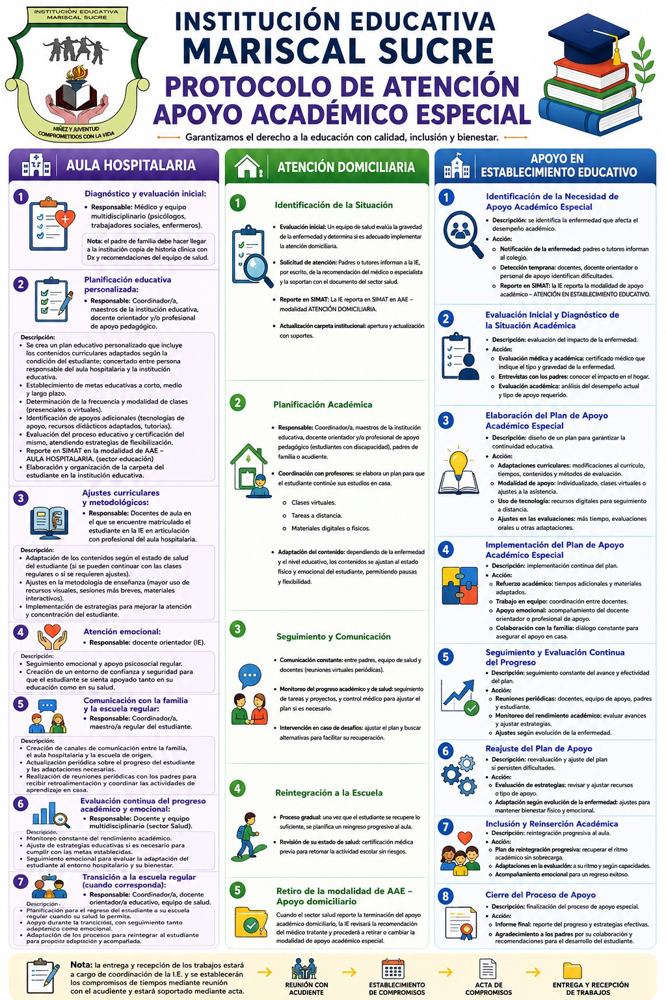

# METODOLOGIA PEDAGOGICA ESCUELA ACTIVA

La metodología de Escuela Activa de la Institución Educativa Mariscal Sucre se fundamenta en un modelo cognitivo y constructivista que concibe la enseñanza a partir del interés natural, la voluntad y la libertad del estudiante, superando el paradigma tradicional y conductista para propiciar una autoeducación progresiva basada en el ejercicio de la razón.

Asimismo, este enfoque asimila corrientes naturalistas y humanistas donde el ser humano —constituido por corporeidad y espiritualidad— se erige como el protagonista único e irrepetible del proceso educativo, orientando su formación integral hacia el ennoblecimiento, la empatía en las relaciones con el Otro, el amor por la naturaleza y la responsabilidad social.

En consecuencia, la práctica pedagógica trasciende la simple transferencia de conceptos y normas para potenciar el espíritu crítico y reflexivo de niños, jóvenes y adultos, capacitándolos como ciudadanos éticos y agentes transformadores de su entorno familiar y comunitario.

## APOYO ACADÉMICO ESPECIAL (Decreto 1470 de 2013)

A continuación, se presenta la organización del requerimiento normativo del Decreto 1470 de 2013 estructurado en una matriz técnica de gestión institucional:

|Componente de Ruta|Modalidad de Atención|Población Objeto|Acciones Clave de Implementación|Evidencia / Soporte Documental|Responsable Directo|
|---|---|---|---|---|---|
|Ruta 1: Hospitalaria|Centros de salud / Clínicas|Estudiantes internados por cortos, medianos o largos periodos.|• Coordinación con aulas hospitalarias.  • Envío de guías flexibles.  • Flexibilización de tiempos de entrega.|• Reporte de ingreso hospitalario.  • Plan de Aula Hospitalaria.  • Registro de notas adaptadas.|Coordinador Académico y Docente de Área|
|Ruta 2: Domiciliaria|Hogar del estudiante|Convalecientes en casa con incapacidad o prescripción médica.|• Tutorías virtuales o asignación de material.  • Plan Individual de Ajustes (PIAR).  • Entrega física o digital de talleres.|• Certificado médico oficial.  • Cronograma de tutorías.  • Constancia de entrega de guías.|Docente de Aula y Orientación Escolar|
|Ruta 3: Instituciones de Apoyo|Fundaciones / Centros de rehabilitación|Alumnos en hogares de paso o IPS especializadas.|• Convenios de cooperación académica.  • Seguimiento conjunto con personal de apoyo.  • Adaptación curricular según el tratamiento.|• Convenio o acta de articulación.  • Informes de evolución del centro.  • Registro de valoraciones.|Rectoría y Profesional de Apoyo|
|Ruta 4: Intraescolar|Aula regular en la institución|Estudiantes que retornan pero requieren soporte transitorio.|• Ajustes razonables en el aula.  • Exención temporal de ciertas actividades físicas.  • Evaluaciones diferenciadas.|• Acta de flexibilización curricular.  • Diario de campo del docente.  • Plan de nivelación académica.|Docente de Aula y Comité de Evaluación|
: Matriz Técnica de Articulación: Apoyo Académico Especial (Decreto 1470 de 2013) {.responsive #tbl-apoyo-academico}

### Componentes Transversales de la Matriz

Incorporación Institucional: Modificación e inclusión de estas cuatro rutas en el Proyecto Educativo Institucional (PEI) y en el Manual de Convivencia.

Monitoreo General: El Comité de Evaluación y Promoción debe validar los reportes de notas diferenciados para evitar la deserción o reprobación por motivos de salud.
