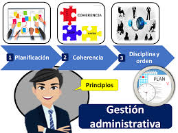

# GESTION ADMINISTRATIVA Y FINANCIERA

La Gestión Administrativa y Financiera de la Institución Educativa Mariscal Sucre da soporte al trabajo institucional mediante el suministro, manejo y fiscalización eficiente de los recursos humanos, físicos y financieros, orientando su organización sistemática a la optimización de los procesos de docencia, investigación y proyección social.

Alineada con los objetivos de calidad y los cambios estratégicos implementados a partir de 2025, esta área busca la satisfacción de toda la comunidad educativa a través de la sistematización operativa, la asignación de funciones según perfiles de cargo, el seguimiento al desempeño y la búsqueda de nuevas fuentes de financiación para mejorar la infraestructura escolar.

Asimismo, consolida el funcionamiento óptimo de la gestión académica mediante procesos rigurosos de matrícula, archivo institucional y expedición de boletines, operando bajo una unidad de gestión secretarial y de registro totalmente organizada conforme a los parámetros y orientaciones normativas de la Secretaría de Educación de Manizales (SEM).

|Dimensión de Gestión|Componente / Servicio|Lineamiento Técnico y Enfoque Operativo|Despliegue en las Sedes (Central, C y D)|Instrumento de Control / Evidencia|
|---|---|---|---|---|
|🏢 1. Recursos Físicos y Planta Física|Plan de Mantenimiento Preventivo y Correctivo|• Conservación continua de la infraestructura.  • Organización por zonas (4 pisos, áreas comunes, redes).|• Acciones programadas de aseo, restauración de mobiliario y cuidado hidráulico/eléctrico.|• Bitácora de mantenimiento.  • Manual de Procedimientos e Inventarios.|
||Cultura de Orden y Limpieza (PRAE)|• Sensibilización y capacitación del personal en autodisciplina.  • Articulación con Ciencias Naturales.|• Implementación de estrategias de estandarización y aseo en los sitios de trabajo escolar.|• Documento del Eje de Educación Ambiental y Gestión del Riesgo.|
||Plan de Seguridad Institucional|• Protección de personas, instalaciones y bienes materiales ante la ausencia de celador.|• Monitoreo electrónico continuo y vigilancia digital en puntos estratégicos.|• Reportes de soporte técnico del sistema de cámaras y alarmas.|
|🍉 2. Servicios Complementarios|Alimentación Escolar y Bienestar|• Mitigación de la vulnerabilidad socioeconómica.  • Soporte nutricional para la permanencia.|• Restaurante escolar para la Jornada Única y refrigerios para Básica Primaria.  • Tienda escolar.|• Registro de beneficiarios SIMAT.  • Actas de interventoría del servicio.|
||Salud, Emergencias y Riesgos|• Atención básica en salud y primeros auxilios.  • Construcción del panorama de riesgos.|• Área de enfermería atendida por Enfermero Calificado.  • Coordinación con Bomberos y La Previsora.|• Panorama de Riesgos Legal.  • Fichas de atención de enfermería.|
||Apoyo Pedagógico y Psicológico|• Fortalecimiento socioemocional y atención diferencial con enfoque de derechos.|• Acciones conjuntas de la Psicorientadora docente y los funcionarios de la SEM.|• Bitácora de seguimiento a casos.  • Planes de Apoyo Emocional.|
||Servicio Social Estudiantil|• Formación en valores de solidaridad, empatía y conocimiento del entorno social.|• Estudiantes de la Media (10° y 11°) integrados a proyectos comunitarios y familiares con entidades aliadas.|• Tarjetas de control de horas (100 horas reglamentarias).|
||Seguro Escolar y Textos de Consulta|• Cobertura médica voluntaria de incidentes.  • Profundización y consulta dirigida.|• Oferta de seguro médico nacional al inicio de año.  • Suministro y uso de variedad de textos en biblioteca.|• Pólizas voluntarias archivadas.  • Inventario de textos por área.|
|👥 3. Gestión del Talento Humano|Evaluación y Desarrollo Profesional|• Vinculación de capacidades intelectuales y artísticas.  • Garantía de condiciones de trabajo óptimas.|• Procesos formales de inducción.  • Identificación de necesidades de capacitación del personal.|• Protocolos del procedimiento documentado de Talento Humano.|
||Mecanismos de Valoración del Desempeño|• Seguimiento al cumplimiento de funciones y metas según el tipo de vinculación legal.|• Decreto 1278: Formatos oficiales MEN / CNSC.  • Decreto 2277: Autoevaluación de seguimiento.  • Administrativos: Rúbricas SEM.|• Evaluaciones de desempeño anuales firmadas y radicadas.|
: Matriz Técnica del Horizonte Administrativo Institucional {.responsive #tbl-horizonte-administrativo}

## ⚙️ Protocolo de Optimización Presupuestal y Logística

Inversión Estratégica de Excedentes: De acuerdo con las directrices de la política de transparencia, los excedentes financieros del Fondo de Servicios Educativos se redirigirán anualmente a sectores estratégicos: dotación de medios educativos, fortalecimiento de las aulas del Nodo STEM, investigación escolar y programas de salud física y mental para el bienestar institucional.

Articulación de la Cultura PRAE con el Talento Humano: El Enfermero Calificado y los docentes de Ciencias Naturales liderarán las brigadas de emergencia del COPASST, unificando el panorama de riesgos con la capacitación situada del personal administrativo y docente, asegurando un entorno cardioprotegido y seguro en las tres sedes del colegio.

|CARGO|CRITERIOS PARA LA EVALUACIÓN DE DESEMPEÑO|ESTRATEGIAS PARA CAPACITACIÓN|INDUCCIÓN|
|---|---|---|---|
|DOCENTES Y DIRECTIVOS|Dominio curricular. Planeación y organización Pgógica y didáctica Evaluación del aprendizaje Uso de recursos Seguimiento de procesos Comunicación institucional Comunidad y Entorno|Plan de mejoramiento. Cualificación docente dirigida desde SEM|PEI Manual de convivencia SIE|
|ADMINISTRATIVOS|Criterios propios del cargo dados por la Comisión nacional del estado Civil y adoptados por la SEM. Acuerdos personales. Cursos de capacitación y cualificación con una intensidad mínima de 40 horas anuales.|Manual de funciones y perfiles. Empalmes entre las personas salientes y entrantes.|Charla con el rector sobre los acuerdos y perfiles de las personas. Servicio al cliente.|
: Criterios para la Evaluación de Desempeño de Administrativos, Docentes y Docentes Directivos {.responsive #tbl-evaluacion-desempeno}

### Apoyo financiero y contable

El componente de Apoyo Financiero y Contable de la Institución Educativa Mariscal Sucre opera bajo un presupuesto anual fundamentado en el Decreto 4791 de 2008, financiado por transferencias del CONPES, recursos municipales del SIMAT e ingresos propios, cuya ejecución coordina un Comité de Compras para rubros de funcionamiento e inversión en proyectos científicos, culturales y deportivos.

No obstante, la administración de su infraestructura —distribuida en cinco edificaciones— afronta severos retos logísticos y limitaciones presupuestales críticas, reflejados en el contraste entre las sedes de primaria (amplias y con zonas verdes) y la Sede Central, la cual padece de aulas insuficientes que obligan a reubicar grados de bachillerato, servicios sanitarios deficientes, oficinas compartidas para secretaría y tesorería, y una total falta de adecuaciones físicas de accesibilidad para la población con discapacidad bajo el Decreto 1421 de 2017.

Esta situación de vulnerabilidad de la planta física escolar se agudiza por la ausencia absoluta de personal de celaduría, dejando las instalaciones desprotegidas durante fines de semana y periodos vacacionales, lo que expone recurrentemente los vidrios, tejas y rejas del plantel a robos y actos vandálicos que afectan el bienestar de la comunidad educativa.

Descripción de la planta física

La planta física de la Institución Educativa Mariscal Sucre está conformada por tres edificaciones distribuidas entre sus sedes fusionadas, evidenciando un contraste operativo donde las plantas de básica primaria disfrutan de espacios amplios, zonas verdes y áreas para restaurante escolar, mientras que la Sede Central de bachillerato padece de aulas insuficientes que obligan a reubicar grados en la primaria más próxima, servicios sanitarios deficientes y una oficina compartida para los servicios de secretaría y tesorería.

Esta infraestructura, administrada por un rector y dos coordinadores, sirve ocasionalmente como espacio de proyección para eventos comunitarios; sin embargo, debido a la escasez de recursos y a la total ausencia de personal de celaduría, las instalaciones carecen de adecuaciones de accesibilidad física para la población con discapacidad y sufren de constantes actos vandálicos, robos y daños materiales durante los fines de semana y periodos vacacionales. (Anexo 2. planos edificaciones)

## PROCEDIMIENTO PARA UTILIZACION DE BIENES

El Procedimiento para la Utilización de Bienes y Espacios de la Institución Educativa Mariscal Sucre regula el préstamo, cuidado y custodia de sus activos de beneficio público, los cuales son propiedad del ente territorial certificado y están bajo la administración legal del Rector como ordenador del gasto.

Autorizado por el Consejo Directivo, este trámite establece que el uso de las instalaciones o bienes devolutivos no tendrá costo alguno cuando se oriente a actividades de la comunidad escolar, pero devengará un pago equivalente a los referentes del mercado si persigue un beneficio económico particular, fondos que deberán consignarse en la cuenta del Fondo de Servicios Educativos.

Los usuarios o tenedores adquieren la responsabilidad directa de garantizar el buen uso, emplear los recursos en acciones legales y reponer los elementos en las mismas condiciones recibidas en caso de pérdida, hurto o daño; este proceso operativo se formaliza de manera estricta mediante un flujo de cuatro pasos que comprende el diligenciamiento del formulario oficial, el pago en tesorería (si aplica), la firma del compromiso de responsabilidad al recibir el bien y la posterior verificación técnica tras su devolución. (Anexo 3 formato solicitud préstamo instalaciones)

|Componente Financiero|Lineamiento Técnico y Normativo|Parámetros Operativos y Montos|Procedimiento y Requisitos de Desembolso|Mecanismo de Control e Informes (Rendición de Cuentas)|
|---|---|---|---|---|
|🎉 1. Eventos Institucionales (Pedagógicos, STEM, PRAE y Culturales)|• Supeditado al Decreto 4791 de 2008.  • Requiere inclusión previa en planeación financiera (Plan de Compras).|• Monto Máximo: Hasta 2 SMLMV por evento con cargo al FSE.  • Excedentes: Autogestionados por líderes del proyecto.  • Austeridad: Gasto público restringido.|• Solicitud de Disponibilidad Presupuestal (CDP).  • Radicación en Tesorería: Cuenta de cobro/factura, RUT y aportes a Seguridad Social del contratista.|• Informe Ejecutivo: Radicación ante Rectoría en 15 días hábiles (Metas vs. Logros, FODA e Indicadores).  • Insumo para Informe de Gestión Anual.|
|💰 2. Excedentes y Recursos Generados en Eventos|• Connotación social orientada al beneficio de la comunidad.  • Principio de no compensación contable.|• El 100% de los ingresos extraordinarios se incorpora al presupuesto general del FSE.|• Recaudo directo en la cuenta del Fondo de Servicios Educativos.  • Reconocimiento de hechos financieros paralelos (Ingreso/Gasto).|• Reporte explícito en la rendición de cuentas pública del Consejo Directivo.|
|🏛️ 3. Administración y Fuentes del FSE (Planta Física)|• Gobernanza compartida: Rector (Ordenador) y Consejo Directivo (Aprobador).  • Estatuto Contractual Público.|• Fuentes: 1. Públicas (CONPES / Transferencias Municipales).  • 2. Recursos Propios (Certificados y costos fijados por la SEM).|• Elaboración del proyecto de presupuesto anual por parte del Rector.  • Operación de un Comité de Compras y un equipo de Tesorería/Contabilidad.|• Ejecución Trimestral: Informes obligatorios presentados al Consejo Directivo.  • Envío semestral/anual a la Contraloría de Caldas y SEM.|
: Matriz de Gestión Financiera: Eventos Institucionales y Administración del FSE {.responsive #tbl-gestion-financiera}

## ⚙️ Protocolo de Control Fiscal y Operativo del FSE

Regulación de Eventos No Programados: Cuando se requiera la realización excepcional de un evento pedagógico, científico o tecnológico (Nodo STEM) no incluido en la agenda anual, los responsables deberán tramitar primero una modificación presupuestaria ante el Consejo Directivo, sustentando su relevancia frente al PEI para la expedición de un nuevo CDP, asegurando que ninguna actividad inicie sin amparo presupuestal y contractual.

Transparencia Contractual en Infraestructura: Las compras, reparaciones locativas menores o dotaciones ejecutadas para mitigar las deficiencias de la planta física (como los servicios sanitarios o el vandalismo por falta de celador) se someterán rigurosamente al manual de contratación del colegio y a las actas de evaluación del Comité de Compras. Esto garantiza la trazabilidad del gasto antes de que la contadora pública de la institución procese los estados financieros bimestrales.

## ⚙️ Lineamientos Operativos para la Ejecución del Plan

Articulación Normativa Externa: La institución acatará de forma estricta los cronogramas de capacitación de la Secretaría de Educación de Manizales (SEM) en temas prioritarios de inclusión educativa \[1421/2017\], primeros auxilios psicopedagógicos y actualización del panorama de riesgos.

Enfoque de Calidad en la Inducción: El proceso de inducción para docentes nuevos incluirá obligatoriamente un módulo formativo sobre las didácticas flexibles (GEEMPA para castellano/matemáticas y *Caminar en Secundaria*), garantizando que el personal conozca el nivel socio-psicogenético de su grupo antes de iniciar las clases.
