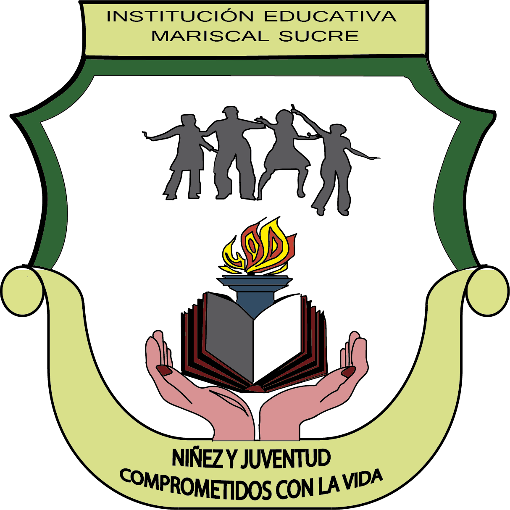

 

**INSTITUCION EDUCATIVA MARISCAL SUCRE** 

**NIT: 890.802.079-2    DANE: 117001002303** 

Preescolar, Básica Primaria, Secundaria y Media vocacional 

Carrera 16 Nº 63-15 Urbanización La Toscana Teléfono y Fax 8752030 

Resolución N° 1740 del 16 de noviembre de 2.011 Manizales 

Correo Electrónico iemariscalsucre@semmanizales.edu.co 

**RESIGNIFICACION PEI IEMS**

**VERSION 3-2026**

**Manizales, JUNIO DE 2026**

**RESIGNIFICACION PEI IEMS**

La resignificación del PEI del Colegio Mariscal Sucre es un paso fundamental para asegurar que la institución continúe cumpliendo su misión de ofrecer una educación integral, equitativa y de calidad. Este proceso permitirá adaptar el proyecto educativo a las nuevas demandas sociales, tecnológicas y ambientales, fortalecer la inclusión y equidad, y consolidar una cultura de sostenibilidad. Al hacerlo, el colegio se posiciona como una institución educativa que no solo responde a los retos del presente, sino que prepara a sus estudiantes para ser ciudadanos responsables y críticos en un mundo en constante cambio El **Proyecto Educativo Institucional (PEI)** de la **Institución Educativa Mariscal Sucre** se estructura en torno a su misión de ofrecer una educación integral, que fomente la equidad, la calidad, y la diversidad. Basado en el desarrollo de competencias en áreas STEM (Ciencia, Tecnología, Ingeniería y Matemáticas), el pensamiento crítico y el fortalecimiento socioemocional, el PEI es una herramienta que guiará las acciones educativas a corto, mediano y largo plazo, asegurando la preparación de los estudiantes para enfrentar los desafíos del mundo moderno. A continuación, se desarrollan los elementos clave del PEI:

[Descargar DOCX original](original/PEI-IEMS-V3-2026.docx)

